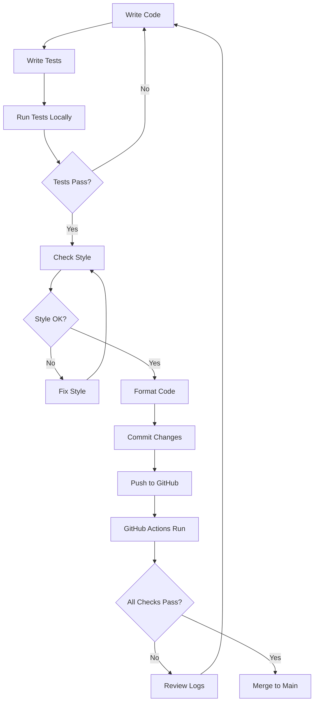

# Calculator Maven Project - Summary

## 📦 Complete Project Overview

This document provides a comprehensive overview of the Calculator Maven Project structure and components.

## 🎯 Project Goals Achieved

✅ **Maven Project Structure** - Standard Java Maven project layout  
✅ **Calculator Implementation** - Full-featured calculator with 6+ operations  
✅ **JUnit 5 Tests** - 35+ test cases with parameterized and nested tests  
✅ **Custom Checkstyle Rules** - Enforces naming conventions (mstr, mi, mb, p*)  
✅ **Code Formatting** - Automated formatting validation and correction  
✅ **GitHub Actions CI/CD** - Complete pipeline with 4 stages  

## 📁 Complete File Structure

```
calculator-maven-project/
│
├── 📁 .github/
│   └── 📁 workflows/
│       └── 📄 ci-cd.yml                          # GitHub Actions workflow (161 lines)
│
├── 📁 src/
│   ├── 📁 main/
│   │   └── 📁 java/
│   │       └── 📁 com/example/calculator/
│   │           └── 📄 Calculator.java            # Main calculator class (143 lines)
│   │
│   └── 📁 test/
│       └── 📁 java/
│           └── 📁 com/example/calculator/
│               └── 📄 CalculatorTest.java        # JUnit 5 tests (285 lines)
│
├── 📄 pom.xml                                    # Maven configuration (108 lines)
├── 📄 checkstyle.xml                             # Checkstyle rules (82 lines)
├── 📄 formatter-config.xml                       # Formatter config (22 lines)
│
├── 📄 README.md                                  # Main documentation (420 lines)
├── 📄 QUICK_START.md                             # Quick start guide (240 lines)
├── 📄 PROJECT_SUMMARY.md                         # This file
│
├── 📄 .gitignore                                 # Git ignore rules
├── 📄 setup-and-test.sh                          # Linux/Mac setup script
└── 📄 setup-and-test.bat                         # Windows setup script
```

## 🔧 Key Components

### 1. Calculator.java

**Location:** `src/main/java/com/example/calculator/Calculator.java`

**Features:**
- 6 mathematical operations (add, subtract, multiply, divide, power, squareRoot)
- State management (tracks operation count and last result)
- Error handling (division by zero, negative square root)
- Follows custom naming conventions

**Member Variables:**
```java
private int miResultCount;        // Tracks number of operations
private double lstrLastResult;    // Stores last calculation result
```

**Public Methods:**
- `add(pFirstNumber, pSecondNumber)` → double
- `subtract(pFirstNumber, pSecondNumber)` → double
- `multiply(pFirstNumber, pSecondNumber)` → double
- `divide(pNumerator, pDenominator)` → double
- `power(pBase, pExponent)` → double
- `squareRoot(pNumber)` → double
- `getResultCount()` → int
- `getLastResult()` → double
- `reset()` → void

### 2. CalculatorTest.java

**Location:** `src/test/java/com/example/calculator/CalculatorTest.java`

**Test Organization:**

```
CalculatorTest (Main Test Class)
│
├── AdditionTests (Nested Class)
│   ├── testAddPositiveNumbers
│   ├── testAddNegativeNumbers
│   ├── testAddZero
│   └── testAddParameterized (4 variations)
│
├── SubtractionTests (Nested Class)
│   ├── testSubtractPositiveNumbers
│   ├── testSubtractNegativeResult
│   └── testSubtractParameterized (4 variations)
│
├── MultiplicationTests (Nested Class)
│   ├── testMultiplyPositiveNumbers
│   ├── testMultiplyByZero
│   ├── testMultiplyNegativeNumbers
│   └── testMultiplyParameterized (4 variations)
│
├── DivisionTests (Nested Class)
│   ├── testDividePositiveNumbers
│   ├── testDivideByZero
│   ├── testDivideWithDecimalResult
│   └── testDivideParameterized (4 variations)
│
├── PowerTests (Nested Class)
│   ├── testPowerPositive
│   ├── testPowerOfZero
│   ├── testNegativeExponent
│   └── testPowerParameterized (4 variations)
│
├── SquareRootTests (Nested Class)
│   ├── testSquareRootPositive
│   ├── testSquareRootZero
│   ├── testSquareRootNegative
│   └── testSquareRootParameterized (5 variations)
│
├── StateTests (Nested Class)
│   ├── testResultCount
│   ├── testLastResult
│   └── testReset
│
└── IntegrationTests (Nested Class)
    ├── testComplexCalculation
    └── testMixedOperations
```

**Total Test Count:** 35+ test cases (including parameterized variations)

### 3. pom.xml

**Key Dependencies:**
- JUnit Jupiter API 5.9.3
- JUnit Jupiter Engine 5.9.3
- JUnit Jupiter Params 5.9.3

**Build Plugins:**
- maven-compiler-plugin (Java 11)
- maven-surefire-plugin (Test runner)
- maven-checkstyle-plugin (Linting)
- formatter-maven-plugin (Code formatting)

### 4. checkstyle.xml

**Custom Rules:**

| Variable Type | Prefix Required | Example |
|--------------|----------------|---------|
| Member String | `mstr` | `mstrName` |
| Member Integer | `mi` | `miCount` |
| Member Boolean | `mb` | `mbActive` |
| Local String | `lstr` | `lstrResult` |
| Local Integer | `li` | `liIndex` |
| Local Boolean | `lb` | `lbValid` |
| Parameters | `p` | `pFirstNumber` |

**Additional Checks:**
- No star imports
- No unused imports
- Method length max 150 lines
- Max 7 parameters per method
- Proper whitespace and formatting
- Proper brace placement

### 5. GitHub Actions Workflow (ci-cd.yml)

**Pipeline Stages:**

#### Stage 1: Lint
- Runs Checkstyle validation
- Enforces naming conventions
- Uploads checkstyle reports
- Runs on: ubuntu-latest
- Java: 11 (Temurin)

#### Stage 2: Format Check
- Validates code formatting
- Provides formatting instructions
- Demonstrates auto-formatting
- Runs independently of lint

#### Stage 3: Test
- Depends on: lint, format-check
- Runs all JUnit 5 tests
- Generates Surefire reports
- Publishes test results
- Uploads test artifacts

#### Stage 4: Build
- Depends on: test
- Compiles project
- Creates JAR package
- Uploads build artifacts
- Retention: 30 days

#### Stage 5: Code Quality
- Depends on: all jobs
- Always runs (if: always())
- Downloads all artifacts
- Generates quality summary
- Posts to GitHub Summary

**Trigger Events:**
- Push to `main` or `develop`
- Pull requests to `main` or `develop`
- Manual workflow dispatch

## 🧪 Test Coverage Details

### Test Types

1. **Unit Tests**: Test individual methods in isolation
2. **Parameterized Tests**: Test same logic with different inputs
3. **Exception Tests**: Verify error handling
4. **State Tests**: Validate internal state management
5. **Integration Tests**: Test complex operation sequences

### Coverage by Operation

| Operation | Test Cases | Includes Parameterized |
|-----------|-----------|----------------------|
| Addition | 4 | ✅ (4 variations) |
| Subtraction | 3 | ✅ (4 variations) |
| Multiplication | 4 | ✅ (4 variations) |
| Division | 4 | ✅ (4 variations) |
| Power | 4 | ✅ (4 variations) |
| Square Root | 4 | ✅ (5 variations) |
| State Management | 3 | ❌ |
| Integration | 2 | ❌ |

## 📊 Code Metrics

- **Total Lines of Code**: ~1,400 lines
- **Java Source Files**: 1
- **Test Files**: 1
- **Configuration Files**: 4
- **Documentation Files**: 3
- **Scripts**: 2
- **Test Cases**: 35+
- **Methods in Calculator**: 9
- **Test Classes (nested)**: 8

## 🚀 Usage Scenarios

### Scenario 1: Local Development

```bash
# 1. Make changes
vim src/main/java/com/example/calculator/Calculator.java

# 2. Run tests
mvn test

# 3. Validate style
mvn checkstyle:check

# 4. Format code
mvn formatter:format

# 5. Build
mvn package
```

### Scenario 2: Continuous Integration

```
Developer → Push to GitHub
     ↓
GitHub Actions Triggered
     ↓
Lint → Format Check → Test → Build
     ↓
All Pass → Merge to Main
     ↓
Artifacts Available for Download
```

### Scenario 3: Code Review

```
1. Create feature branch
2. Make changes
3. Push to GitHub
4. Open Pull Request
5. GitHub Actions runs automatically
6. Review results in PR
7. Fix any issues
8. Merge when all checks pass
```

## 🎓 Learning Outcomes

By exploring this project, you'll learn:

1. ✅ Maven project structure and configuration
2. ✅ JUnit 5 testing patterns (nested, parameterized)
3. ✅ GitHub Actions CI/CD pipelines
4. ✅ Code quality tools (Checkstyle, Formatter)
5. ✅ Custom coding conventions
6. ✅ Artifact management and reporting
7. ✅ Test-driven development practices
8. ✅ Exception handling and testing

## 🔄 Typical Development Workflow



## 📈 Extensibility

This project can be extended with:

- [ ] More mathematical operations (sin, cos, tan, log)
- [ ] Calculator history feature
- [ ] Complex number support
- [ ] Expression parser
- [ ] REST API layer
- [ ] Web UI frontend
- [ ] Code coverage reporting (JaCoCo)
- [ ] Mutation testing (PIT)
- [ ] Performance benchmarks (JMH)
- [ ] Docker containerization
- [ ] Database persistence

## 🏆 Best Practices Demonstrated

✅ **Separation of Concerns**: Source and test code separated  
✅ **Test Organization**: Nested classes for logical grouping  
✅ **Parameterized Testing**: Reduce test code duplication  
✅ **Custom Display Names**: Readable test reports  
✅ **Exception Testing**: Proper error handling validation  
✅ **State Management**: Track operation history  
✅ **CI/CD Pipeline**: Automated quality gates  
✅ **Code Quality**: Automated linting and formatting  
✅ **Documentation**: Comprehensive README and guides  
✅ **Version Control**: Proper .gitignore configuration  

## 📞 Support & Resources

- **Documentation**: See `README.md`
- **Quick Start**: See `QUICK_START.md`
- **Issues**: Use GitHub Issues
- **Scripts**: `setup-and-test.sh` or `.bat`

---

**Project Status: ✅ Complete and Ready for Use**

Last Updated: 2025-11-07

